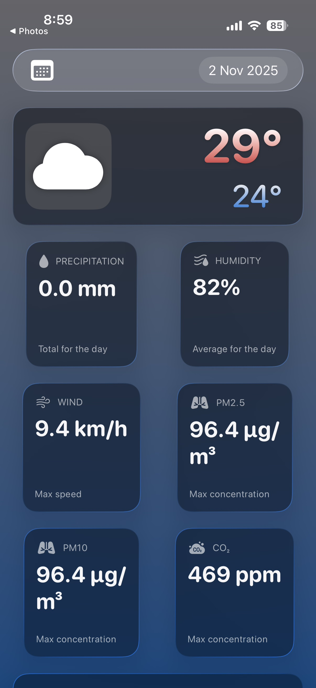
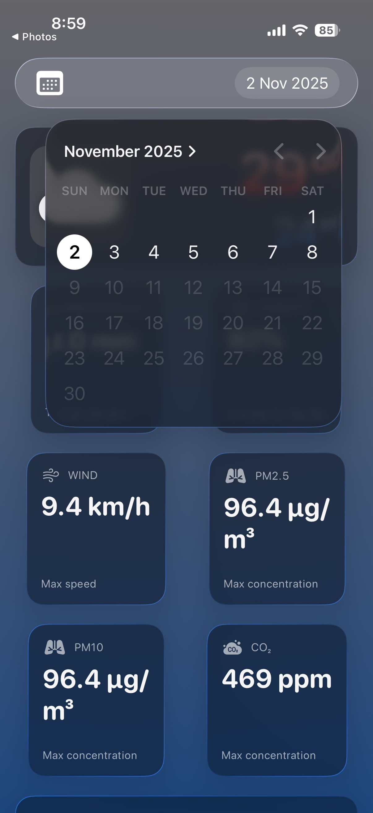
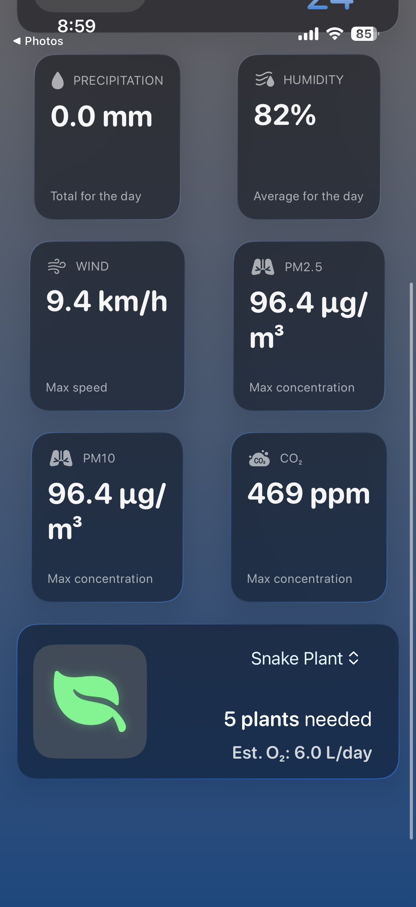
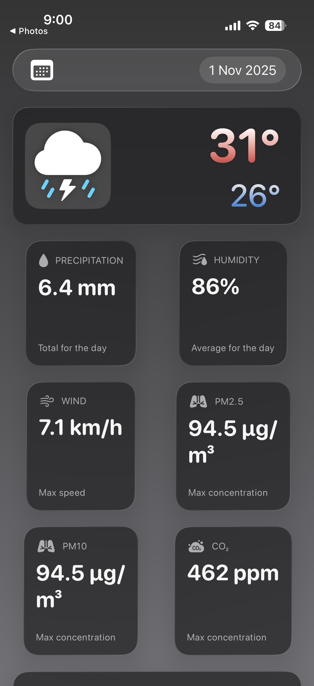
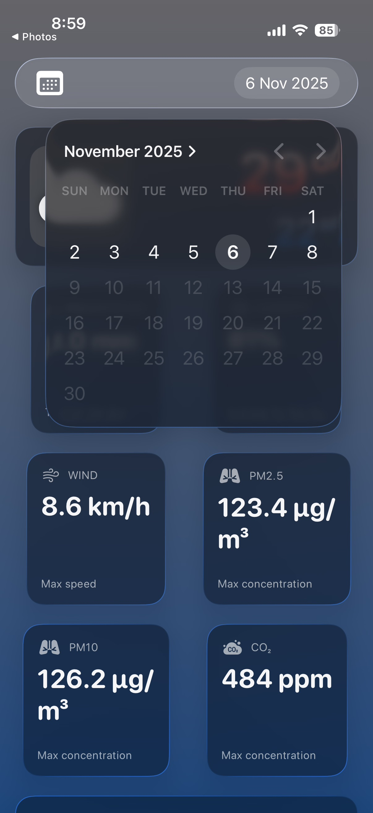

⚛️ ClimateGuard: A Smart iOS Weather & CO₂ Monitor
ClimateGuard is a personal iOS project built entirely in SwiftUI. It's a clean, modern weather app that goes beyond a simple forecast by integrating live air quality data, with a special focus on CO₂.

The app's core feature connects this live CO₂ data to a tangible, real-world action: it calculates the number of common indoor plants needed to sequester (absorb) the carbon in a standard room. It was built to practice modern SwiftUI, advanced API integration, and creating a data-driven, solution-oriented UI.

Live Weather & AQI    Interactive Date Picker    Dynamic Plant Calculator
        
🌦️ Features
Dynamic Weather Dashboard: A clean, responsive UI that displays the day's max/min temperature, precipitation, humidity, and wind speed.
7-Day Forecast: A compact, glass-style DatePicker allows users to select any day in the 7-day forecast and instantly update all data modules.
Real-Time Air Quality: Monitors critical air quality metrics, including PM2.5, PM10, and CO₂ levels.
Dynamic Backgrounds: The app's LinearGradient background subtly changes based on the current weather conditions (e.g., cloudy, sunny, thunderstorm).
CO₂ Sequestration Calculator: The app's signature feature. It reads the live CO₂ ppm value from the API and dynamically calculates the number of plants needed to clean a room.
Plant-Specific Data: The user can pick from different indoor plants (like Snake Plant, Pothos, etc.), and the app recalculates the quantity based on that plant's specific CO₂ absorption rate.
O₂ Emission Estimates: As a companion to the CO₂ calculation, the app also shows the estimated oxygen (O₂) produced by the recommended number of plants.
Modern MVVM Architecture: Built on a modern, @Observable ViewModel to cleanly separate business logic from the view.
📱 App Showcase
Thunderstorm (Nov 1)    Cloudy (Nov 2)    Future Forecast (Nov 6)
        
🔬 Core Logic: The CO₂ Calculator
The most interesting technical challenge was connecting an abstract air quality number (CO₂ in parts per million) to a physical, actionable number (quantity of plants). This required a scientific calculation to bridge the gap in units.

The API provides CO₂ as a concentration (ppm), but plants absorb a mass (grams per day). Here's how the app solves this:

1. Calculate CO₂ Mass in a Room First, the ViewModel converts the ppm concentration into a total mass of CO₂ (in grams) within a standard-sized room.

Swift
// In ViewModel.swift

// Get the live CO2 concentration from the API
let co2ConcentrationPPM = self.carbonDioxideMax ?? 0.0

// Define our constants
let roomVolumeM3 = 32.6 // Aprox 12x12x8 ft room
let co2DensityG_Per_M3 = 1980.0 // Density of CO2 in grams/m³

// The formula:
let totalCO2MassInRoomG = roomVolumeM3 * (co2ConcentrationPPM / 1_000_000.0) * co2DensityG_Per_M3
2. Calculate Plants Needed Next, the app gets the absorption rate for the user's selected plant (e.g., "Pothos" absorbs 5.2 g/day) and divides the total CO₂ mass by that rate. It uses ceil() to round up, since you can't have a fraction of a plant.

Swift
// In ViewModel.swift

// Get the Rate (Plant's absorption)
let plantAbsorptionRate = self.selectedPlant.plantAbsorption

// The final calculation: Int(Goal / Rate)
let quantity = Int(ceil(totalCO2MassInRoomG / plantAbsorptionRate))

// This returns the number of plants needed
return quantity
This calculation runs instantly every time the date or the selected plant is changed, providing a dynamic and scientifically-grounded result.

🛠️ Tech Stack & Architecture
Framework: SwiftUI
State Management: @Observable (Swift's modern observation framework)
Architecture: MVVM (Model-View-ViewModel)
Networking: Async/Await with URLSession
Data Models: Codable structs for robust JSON parsing
Design: Custom "glassmorphism" effect (.glassEffect), dynamic LinearGradient backgrounds
API: Open-Meteo (used for both Weather Forecast and Air Quality APIs)
🚀 How to Run
Clone the repository:
Bash
git clone https://github.com/DankestMukund/ClimateApp.git
Open the .xcodeproj file in Xcode.
Build and run on a simulator or a physical device.
👏 Acknowledgements
This project is powered by the free and open-source Open-Meteo API for all weather and air quality data.
